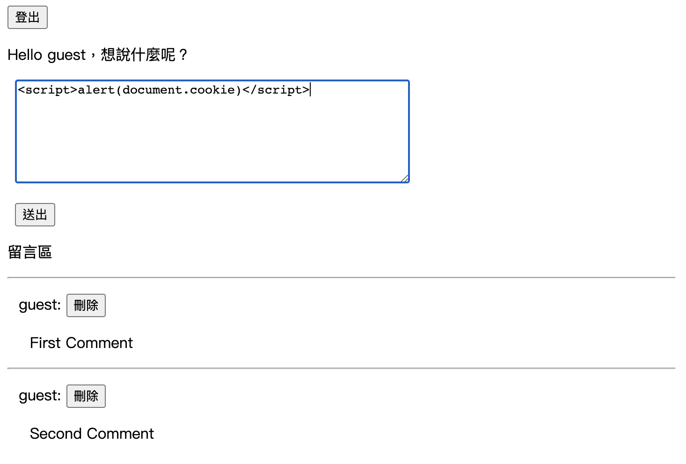
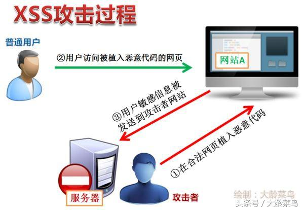
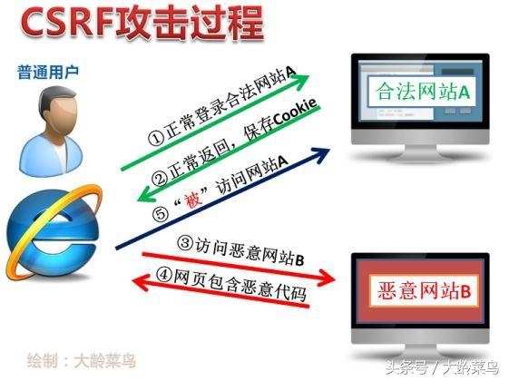
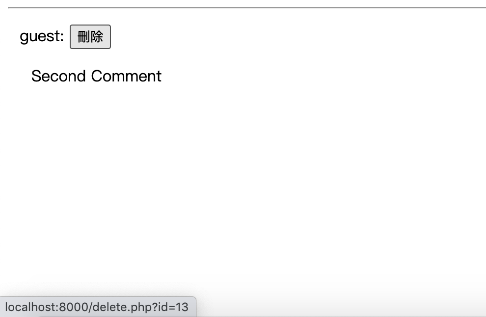
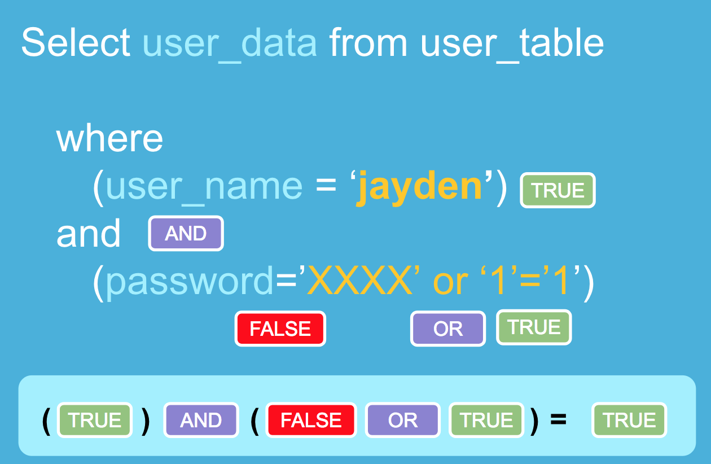
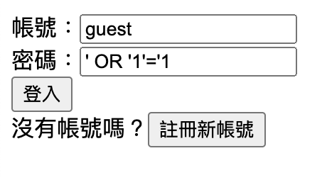
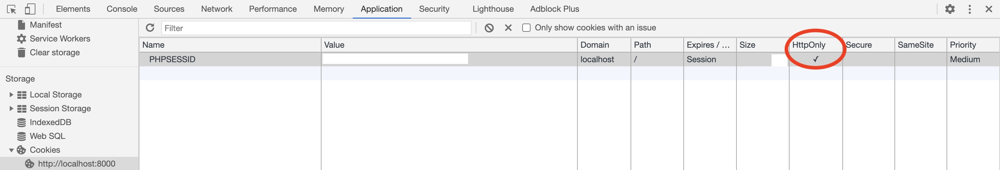

網路安全 Demo
===

這是一個簡單呈現一些網路攻擊的專案。



前置作業
---

這裡有分兩類檔案：

第一種是 .html 檔，是用來呈現簡單的 JavaScript 功能，如何與網路安全扯上關係

第二種是 .php 檔，這不能像 .html 一樣可以直接用瀏覽器開啟，必須架設 PHP 的伺服器，

而這些 .php 檔是在創造一個沒有做什麼資安防護的環境，這裡使用會員系統與留言板來呈現。

### 環境需求

HTML 檔可以直接用瀏覽器開啟。

PHP 的執行環境可以使用 docker 安裝（網路很多教學），或者在 Windows 上的話也可以安裝 wamp。

終極的目的是要一個可以執行 PHP 的環境、可以使用 MySQL。

筆者的做法是在電腦裝 php 7，這樣直接在專案目錄下用終端機執行

```
php -S localhost:8000
```

就可以在 http://localhost:8000 執行 php 程式（微型 server）。

至於 MySQL 的部分是用 docker 安裝 mysql 和 phpMyAdmin（可以瀏覽 MySQL 的工具），

安裝（使用 docker 的 Kitematic）的注意事項是：

mysql 要設置 MYSQL_ROOT_PASSWORD 參數，

phpMyAdmin 的 Network 的 Links 要加入一條：把 mysql 對應到 ALIAS db。

這樣就可以在映射出來的 port 使用 mysql 和 phpMyAdmin 了！（建議也固定 port 設定）。

### 資料庫設定

本專案需要兩張資料表

forum:
```
CREATE TABLE `forum` (
  `id` int NOT NULL,
  `name` text NOT NULL,
  `text` text NOT NULL
)

ALTER TABLE `forum`
  ADD PRIMARY KEY (`id`);

ALTER TABLE `forum`
  MODIFY `id` int NOT NULL AUTO_INCREMENT
```

users:
```
CREATE TABLE `users` (
  `id` int NOT NULL,
  `username` varchar(255) NOT NULL,
  `password` varchar(255) NOT NULL
)

ALTER TABLE `users`
  ADD PRIMARY KEY (`id`),
  ADD UNIQUE KEY `username` (`username`);

ALTER TABLE `users`
  MODIFY `id` int NOT NULL AUTO_INCREMENT;
```

對於使用者密碼驗證需要執行此命令：
```
ALTER USER '使用者名稱' IDENTIFIED WITH mysql_native_password BY '使用者密碼';
```

### 環境變數設定

需要於專案的根目錄新增一個 env.php 檔（或拿 env.php.template 來修改）如下：

```
<?
$DB_HOST = '資料庫主機名稱';
$DB_USER = '資料庫使用者名稱';
$DB_PASSWORD = '資料庫使用者密碼';
$DB_NAME = '資料庫的名稱';
?>
```


介紹
---

### 先備知識（Cookie & Session）

[SessionID.cookie,Session傻傻分不清楚??](https://dotblogs.com.tw/daniel/2017/04/08/110915)

[介紹 Session 及 Cookie 兩者的差別說明](https://blog.hellojcc.tw/introduce-session-and-cookie/)

### JavaScript 的攻擊性

前半段在說明網路攻擊常用在 JavaScript 的哪些特性

註：我們常用 `alert()` 函數做簡單的呈現，因為它可以跳出警告視窗，上面放我們提供的訊息。

#### 重新導向（參考 redirection.html、harmful.html）

JavaScript 重新導向（Redirect）的語法範例（假設 3000 毫秒後跳轉）：

```=JavaScript
<script>
	setTimeout(() => {
		location.href = 'harmful.html'
	}, 3000)
</script>
```

#### 彈跳式視窗（參考 adgen.html、ad.html）

JavaScript 彈跳的語法範例（假設開 10 個視窗）：

```=JavaScript
<script>
	for (let i = 0; i < 10; i++) {
		window.open('ad.html?' + (i + 1), i, 'popup')
	}
</script>
```

#### HTML 標籤：\<iframe>、\、手動的按鈕（參考 iframe.html、img.html）

這些標籤的共同特性為「可以執行JavaScript」!

\<iframe> 中置入 JavaScript 的語法範例（在 onload 中放入 JavaScript 碼）：

```=JavaScript
<iframe onload="alert('竊取的 Cookie：\n' + document.cookie);"></iframe>
```

\<iframe> 中置入 JavaScript 第二種情形的範例（在 src="javascript:" 中放入 JavaScript 碼）：

```=JavaScript
<iframe src="javascript:alert('竊取的 Cookie：\n' + document.cookie);"></iframe>
```

\ 中置入 JavaScript 的語法範例（在 onerror 中放入 JavaScript 碼，再加入一個失效連結）：

```=JavaScript

```

按鈕的範例就省略了（使用 onclick 即可）。

#### 讀取 Cookie 與 Session ID（參考 view_cookie.html）

因為 Session ID 會存在 Cookie 中，所以如果取得 Cookie 就可以取得 Session ID。

但如果有被 HttpOnly 屬性保護的 Cookie 記錄就不能被 JavaScript 讀到了。

JavaScript 讀取 Cookie 的方式很簡單（但是是沒有處理過的）：

```=JavaScript
document.cookie
```

如果要跳出警告視窗：

```=JavaScript
<script>alert(document.cookie)</script>
```

### 常見的網路攻擊

我們是用 PHP 實作出會員系統、留言版來呈現這個部分。


以下是常見的攻擊：

#### XSS（Cross-Site Scripting，跨網站指令碼）



介紹
- Script 放置於文字或是圖片等區塊
- 攻擊者先植入一些代碼
- 使用者來瀏覽的時候就被這些代碼攻擊
- [跨網站指令碼（XSS）](https://zh.wikipedia.org/wiki/跨網站指令碼)
- [淺談兩種常見的跨站攻擊（XSS和CSRF）](https://kknews.cc/tech/z633bbl.html)
- [那些年我们一起学XSS](https://www.ctolib.com/docs/sfile/xss-naxienian/index.html)

情境
- 重新導向
- 彈出式廣告
- 竊取 cookie
- 你能想像用JavaScript做得到的事（參考上面）

防範
- 過濾特殊字元
	- 對輸入做檢查（是否有 HTML Tag 之類的）
- 指定 render 出來的文件類型
  - http header
  - JavaScript 不會當成 HTML 解釋

Demo
- 先去 http://localhost:8000 （或是你的 host address）註冊並且登入
- 你會看到一個留言板系統
- 可以試著將上面所有提到的 Javascript 碼複製到留言框
- 因為我們沒有對留言做檢查，所以可能將這個 HTML 元素呈現出來
  - 因為 PHP 的運作是先在後端跑過一遍，再將已經渲染好的 HTML 丟到前端顯示
  - 所以我們所留言的文字會直接被當成真的 HTML 元素處理

#### CSRF（Cross-site request forgery，跨站請求偽造）



介紹
- Request 放在超連結、按鈕或是圖片等有連結的地方
- 使用者先登入，（而且沒有關閉瀏覽器）
- 在另外的地方（網站）進行需要登入等等的敏感操作
- [讓我們來談談 CSRF](http://blog.techbridge.cc/2017/02/25/csrf-introduction/)

情境
- Call API
- 對資料進行 CRUD 操作
- 進行交易
- 高級隱身術

防範
- 概念：擋掉從別的 domain 來的 request（共同小秘密）
  - 加上圖形驗證碼、簡訊驗證碼等等
  - 加上 CSRF token（回應當下隨機產生的）
  - Double Submit Cookie
    - 比對token和cookie是否一樣（同源）
  - SameSite cookie

Demo
- 當我們維持登入中的時候，我們從其他地方呼叫（可以用像是 Postman 的 API 測試工具試試看）以下連結：
- http://localhost:8000/delete.php?id=要刪除的留言id（在留言板介面將滑鼠移到「刪除上面」左下角就會顯示）
	
- 因為這個請求是需要權限的，但是因為我們沒有關閉瀏覽器或登出，所以 Session 紀錄還在，這樣攻擊者就可以取得權限

### SQL injection（SQL注入）



介紹
- [一次看懂 SQL Injection 的攻擊原理](https://medium.com/@jaydenlin/淺談駭客攻擊-網站安全-一次看懂-sql-injection-的攻擊原理-b1994fd2392a)
- 用恆等式破解 SQL 查詢

情境
- 免輸入密碼
  - e.g. `' OR '1'='1`
- 繞過權限使用 API（內部進行一些 SQL 操作），像是取得會員獨享文章等等

防範
- 參數的類型檢查
- hashing the password

Demo



- 在登入介面，帳號隨便輸入（不必先行註冊也行）
- 密碼打 `' OR '1'='1`
- 這樣便可以成功登入！
- 原因是因為，這個專案的登入檢查的寫法為：
	```
	"SELECT * FROM users WHERE username = '". $username. "' and password = '". $password. "'"
	```
	假設今天 $username = guest, $password = pwd，那麼上面 SQL 指令會是
	```
	SELECT * FROM users WHERE username = 'guest' and password = 'pwd'
	```
	所以如果我讓 $password = `' OR '1'='1`，那麼上面 SQL 指令會是
	```
	SELECT * FROM users WHERE username = 'guest' and password = '' OR '1'='1'
	```
	最後會有一個恆等式 `'1'='1'`，前面又是用 OR 結合，一個對的敘述 OR 任意敘述結果一定是對的，
	所以我就符合登入條件了！

#### HTTP Session

介紹
- [HTTP Session 攻擊與防護](https://devco.re/blog/2014/06/03/http-session-protection/)

情境：取得 cookie 中的敏感資訊（session key）
- 由 XSS 竊取
- 用 ARP欺騙技術(ARP spoofing)中間人攻擊來竊聽
- 如果允許透過 URL 傳遞 Session ID
- 先取得 Session ID 再給不知情的人用

防範
- 確認身份：IP、瀏覽器 User-Agent
- Cookie
  - 設定 Secure Flag (HTTPS)
  - 設定 HTTP Only Flag
- 有狀況就換新
  - 成功登入後立即變更 Session ID

Demo
- 這個專案不實作這部分
- 但是可以在 Chrome 中開啟「開發人員工具」，去到「Application」頁籤
- 點選 Cookies 下面的網站地址
- 接下來就會看到這個網站的 Cookies，我們可以特別去觀察「PHPSESSID」，這就是 PHP 的 Session ID
- 因為我有把 PHP 的 HttpOnly 設成 true，所以這裡會看到他是打勾的
	
- 如果在 https 底下也會開啟 Secure（如果用 http 卻又開啟的話會讀不到 Session）


### 進階練習

這裡列出一些封包擷取分析的工具，有興趣可以來練習。

- [封包分析器](https://zh.wikipedia.org/wiki/數據包分析器)
- [Pcap (packet capture)](https://zh.wikipedia.org/wiki/Pcap)
    - 用於捕獲網絡流量的應用程式接口（API）
    - [TCPDUMP/LIBPCAP public repository](https://www.tcpdump.org/)
- [tcpdump](https://zh.wikipedia.org/wiki/Tcpdump)
    - 執行在命令行下的嗅探工具
- [Wireshark](https://zh.wikipedia.org/wiki/Wireshark)
    - 免費開源的網路封包分析軟體
- [Scapy](https://zh.wikipedia.org/wiki/Scapy)
    - 用於處理掃描、跟蹤

參考資料
---
- [Page hijacking - Wiki](https://en.wikipedia.org/wiki/Page_hijacking)
- [2015年的漏洞攻擊包（Exploit Kit）：充斥著Flash漏洞、淪陷網站和惡意廣告](https://blog.trendmicro.com.tw/?p=17109)
- [SessionID.cookie,Session傻傻分不清楚??](https://dotblogs.com.tw/daniel/2017/04/08/110915)
- [Egg.js Security](https://eggjs.org/zh-cn/core/security.html)
- [淺談兩種常見的跨站攻擊（XSS和CSRF）](https://kknews.cc/tech/z633bbl.html)
- [跨網站指令碼（XSS）](https://zh.wikipedia.org/wiki/跨網站指令碼)
- [那些年我们一起学XSS](https://www.ctolib.com/docs/sfile/xss-naxienian/index.html)
- [讓我們來談談 CSRF](http://blog.techbridge.cc/2017/02/25/csrf-introduction/)
- [一次看懂 SQL Injection 的攻擊原理](https://medium.com/@jaydenlin/淺談駭客攻擊-網站安全-一次看懂-sql-injection-的攻擊原理-b1994fd2392a)
- [HTTP Session 攻擊與防護](https://devco.re/blog/2014/06/03/http-session-protection/)
- [如何使用ARP欺騙技術(ARP spoofing)進行中間人攻擊](https://www.uuu.com.tw/Public/content/article/20/20200217.htm)
- [封包分析器](https://zh.wikipedia.org/wiki/數據包分析器)
- [Pcap (packet capture)](https://zh.wikipedia.org/wiki/Pcap)
- [TCPDUMP/LIBPCAP public repository](https://www.tcpdump.org/)
- [tcpdump](https://zh.wikipedia.org/wiki/Tcpdump)
- [Wireshark](https://zh.wikipedia.org/wiki/Wireshark)
- [Scapy](https://zh.wikipedia.org/wiki/Scapy)